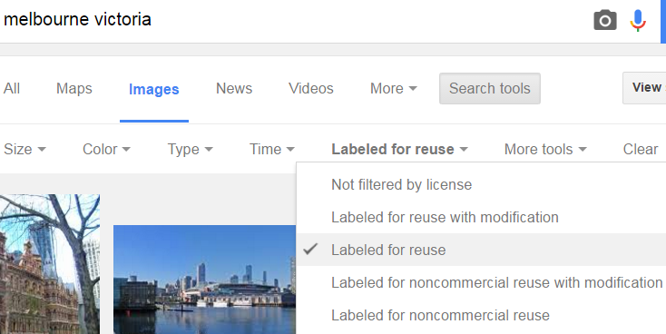

# Datasets used
- LGA  data on Recycling Diversion rates from VIC Govt Annual Waste Services Report 2013-2014
  - Site: ttp://www.sustainability.vic.gov.au/publications-and-research/research/victorian-waste-and-recycling-data-results-201314/victorian-local-government-annual-waste-services-report-201314
  - Data: http://www.sustainability.vic.gov.au/-/media/resources/documents/publications-and-research/research/council-waste-and-recycling-data/local-government-annual-survey-2013_14/victorian_local_government_waste_services_report_workbook_2013_14.xlsx?la=en
- LGA Geographical Profiles 2014 (Beta) by VIC Dept. Health and Human Services
  - https://www.data.vic.gov.au/data/dataset/lga-geographical-profiles-2014-beta

# Price explanations
## Recyclables
The price of recyclables is based on the waste diversion rates published by Sustainability Victoria. The more waste is recycled in a given suburb, the cheaper the price of recycled materials.

## Policing
The price of policing is based on crime data collected from the LGA (Local Government Area) Geographical Profiles collected by the Victorian Department of Health and Human Services. High crime rates mean police are needed, so the price of policing is higher in those suburbs.

## Volunteers
The price of volunteers is based on volunteering rates collected from the LGA Geographical Profiles. The fewer volunteers in a suburb, the more they are needed, which is reflected in higher prices.

## Public services
The price of public services is based on the Index of Relative Socio-Economic Disadvantage collected by the Australian Bureau of Statistics. More disadvantaged areas need more public services, and so public services are worth more in those suburbs.

## Workers
The price of workers is based on the unemployment rate recorded in the LGA Geographical Profiles. To encourage workers to move where they are most needed, workers are more expensive in areas with lower unemployment.

##  Love
The price of love is based on the number of family incidents recorded in the [Victorian Child and Adolescent Monitoring System](http://www.education.vic.gov.au/about/research/Pages/vcams.aspx) family violence survey collected by the [Department of Education and Training](https://www.data.vic.gov.au/data/organization/department-of-education-and-training). Higher rates of family violence demonstrate a need for more love, reflected in higher prices for love in those suburbs.

## Teachers
The price of teachers is based on the number of students recorded in the LGA Geographical Profiles. The more students in a suburb, the more teachers are valued.

## Health facilities
The price of health facilities in a suburb is based on the number of health sites in that suburb according to the LGA Geographical Profiles. Suburbs with fewer health sites have a greater need for health facilities, so the price of health facilities is greater in those suburbs.

## Public transport servcies
The price of public transport services is based on the proportion of the population near public transport facilities according to the LGA Geographical Profiles. Suburbs without accessible public transport need more, so the price of public transport is greater there.

## Child safety services
The price of child safety services is based on the per capita rate of substantiated child abuse cases recorded in the LGA Geographical Profiles. Higher rates of child abuse require more child safety services, reflected in higher prices.

# Suburb description and image sources
4 suburbs per LGA are featured in the game. The summary/description are all taken from Wikipedia, the images are 99% from Wikipedia. A few suburbs did not have high quality images in wikipedia, in these cases, Google image search was used with the 'Labelled for reuse' filter. One exception is the image for Tatyoon, which is taken from ararat local government website. 

The full list of wikipedia article and image source links by be found in this [spreadsheet](suburbs-v2.xlsx), the wikipedia scraping code documented [here](LGA Suburb data (doc).ipyn).

